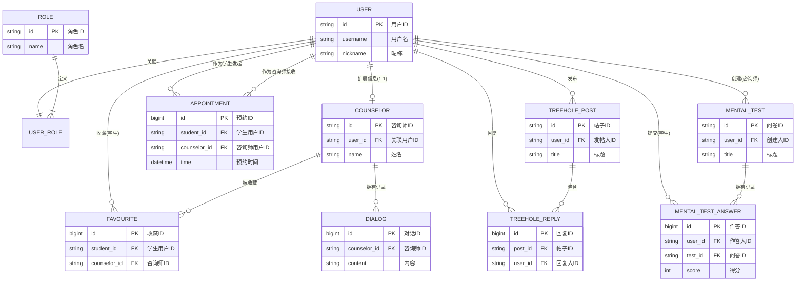

# 数据库设计文档

## 实体关系描述

本系统以**用户 (User)** 为核心实体，通过**用户角色关联 (UserRole)** 与**角色 (Role)** 进行绑定，区分学生、咨询师和管理员身份。若用户为咨询师，则在**咨询师 (Counselor)** 表中存储其专业背景等扩展信息。

在业务流程中：
*   **预约 (Appointment)** 关联了发起预约的学生用户和被预约的咨询师用户。
*   **树洞帖子 (TreeholePost)** 由用户发布，**树洞回复 (TreeholeReply)** 则关联了回复者（用户）和所属的帖子。
*   **心理问卷 (MentalTest)** 由咨询师用户创建，学生的**作答记录 (MentalTestAnswer)** 则关联了对应的问卷和作答学生。
*   **收藏 (Favourite)** 建立了学生用户与咨询师实体之间的关注关系。
*   **对话 (Dialog)** 记录归属于特定的咨询师。

## 实体关系图 (E-R Diagram)

