# 前置工作
## 下载代码并解压代码
1. 将代码code.zip下载
2. 将code.zip解压，注意最好不要解压在含有中文的目录下
## 下载并安装MySQL
1. 通过打开链接 https://dev.mysql.com/downloads/mysql/
2.  按照图片箭头和提示操作
3. 打开刚刚下载的 mysql-8.4.7-win64.msi 文件进行安装          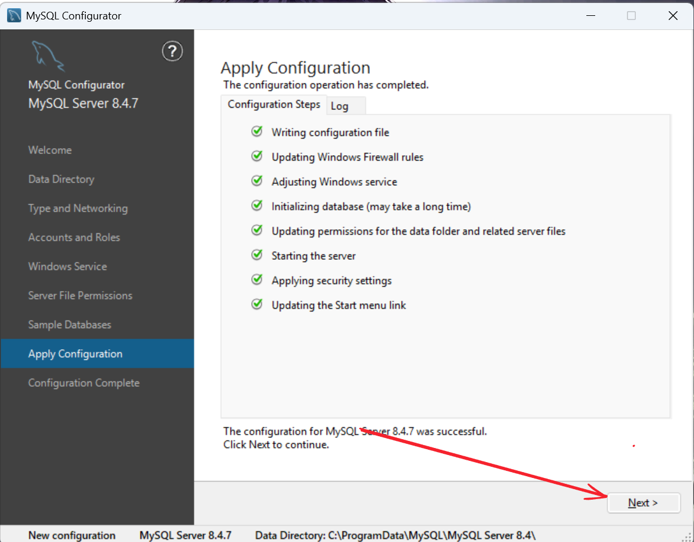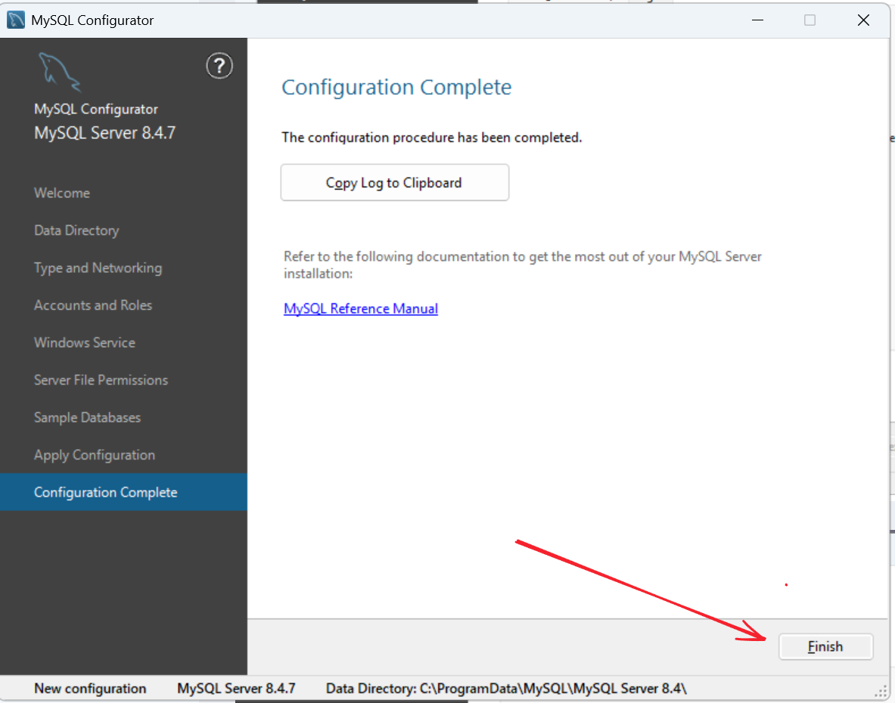  
## 下载并安装Redis
1. 打开链接 https://github.com/redis-windows/redis-windows/releases 下载Redis
2. 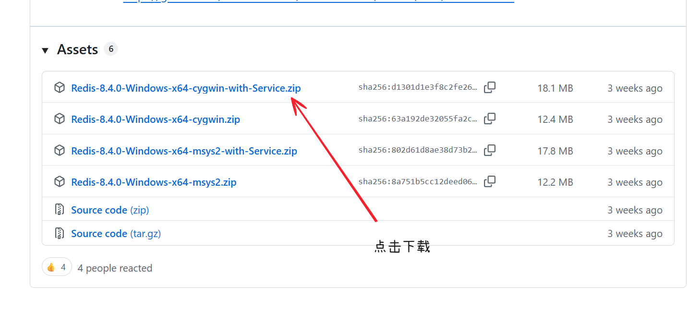 并将下载的 Redis-8.4.0-Windows-x64-cygwin-with-Service.zip 解压，注意建议不要解压到中文目录下
3.  运行解压后的 start.bat 文件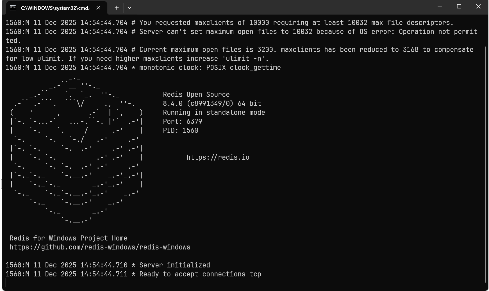 此时出现 Redis 运行窗口，不要关闭，关闭以后Redis即被关闭。
## 下载并安装IDEA
1. 打开链接 https://www.jetbrains.com/zh-cn/idea/download/?section=windows 进行下载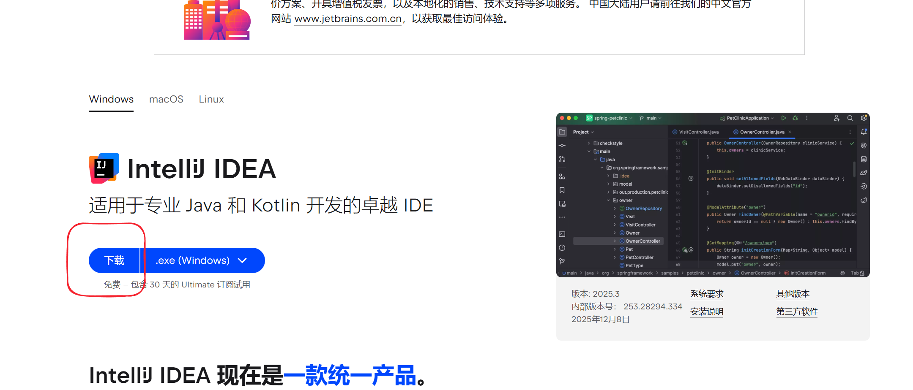 打开IDEA安装程序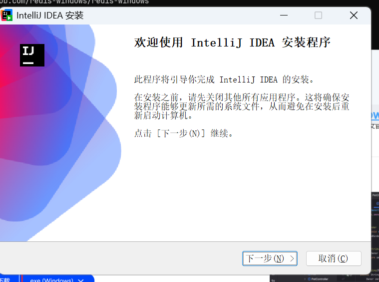 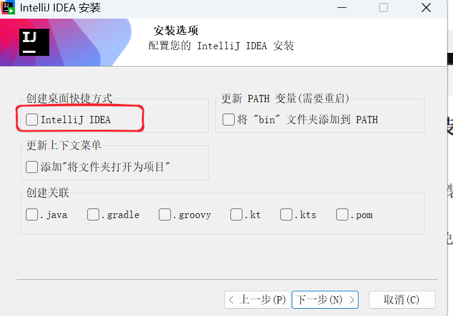 除了需要勾选创建桌面快捷方式，其他一直点击下一步即可。
## 下载安装NodeJS
1. 打开链接 https://nodejs.org/zh-cn/download 
2. 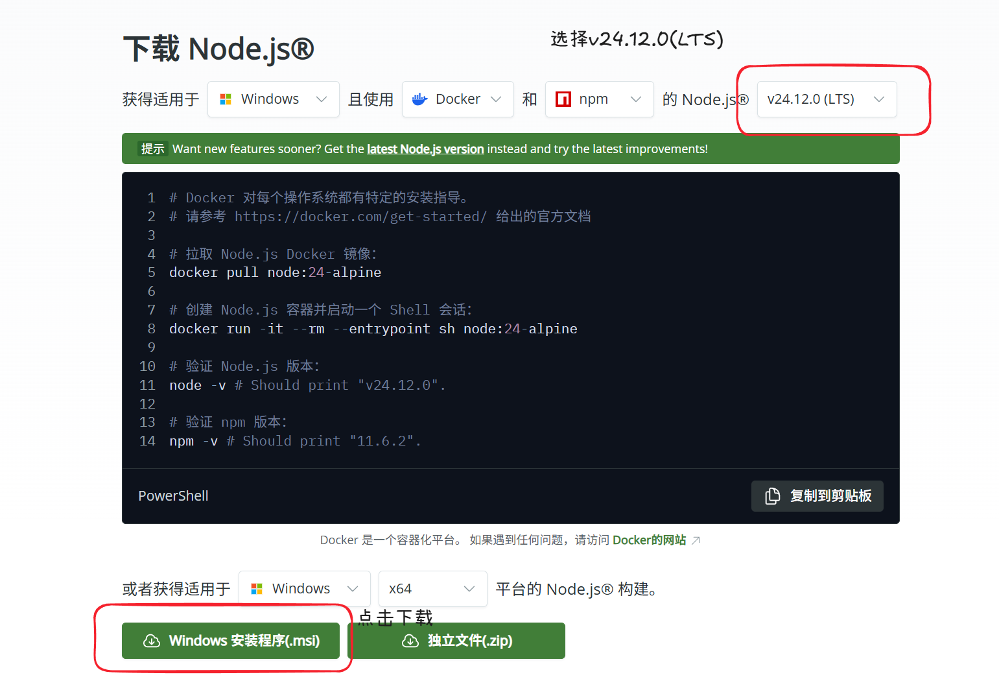 打开下载好的nodejs安装程序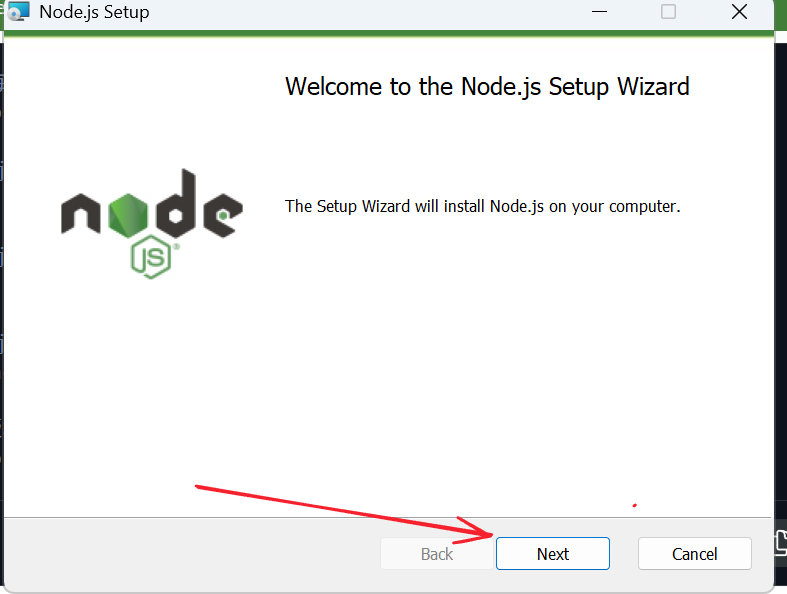 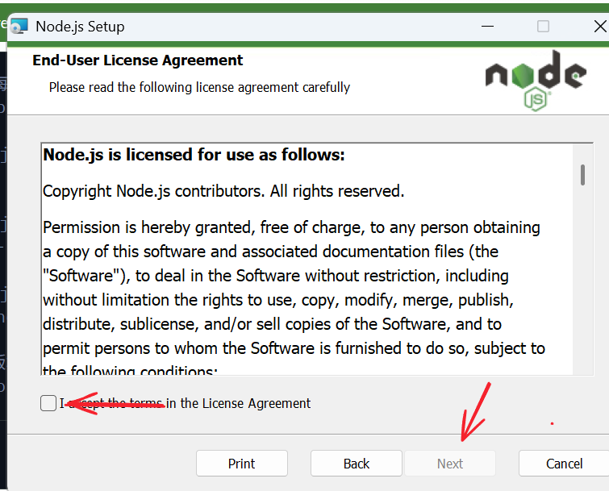 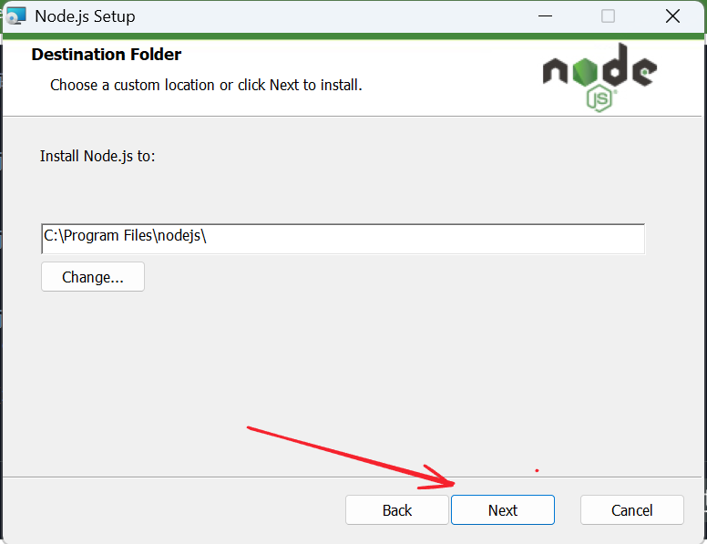 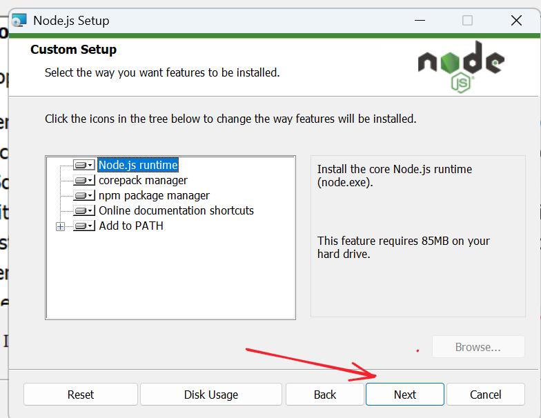  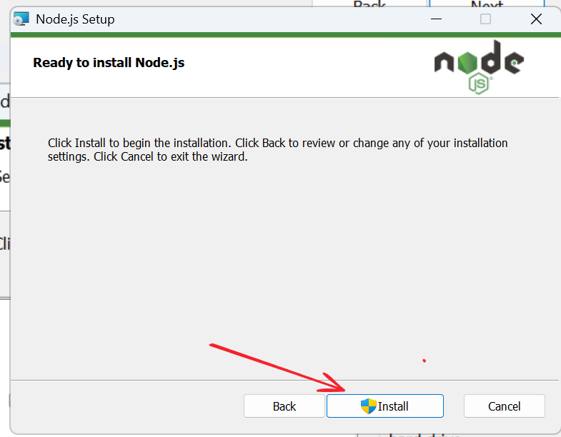 等待即可安装完成
# 运行项目
## 导入项目
1. 打开IDEA
